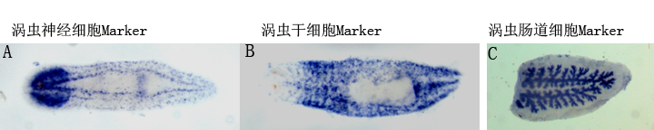
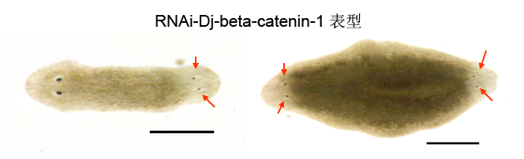

## 欢迎来到我的个人主页

|联系方式| |
|-|-|
| 电话 | 15837365035 |
| 邮箱 | <makexue@sina.com> |

### 个人简介

马克学，男，汉族，博士，副教授，硕士生导师。承担本科生《细胞生物学》和《分子生物学》教学工作。近年来，以淡水涡虫为研究材料，在细胞抗逆性和细胞自噬方面从事科研工作。主持国家自然科学基金面上项目“细胞自噬在涡虫体型重塑中的作用研究”，并参与多项国家及省部级科研项目。在《Front Physiol》、《Ecotoxico Environ Saf》、《Aquatic Toxicol》《Comp Biochem Physiol B》、《Mol Biol Rep》、《Biologia》、《解剖学报》、《水生生物学报》、《遗传》等国内外学术期刊发表论文30余篇，并获得河南省优秀学术论文一等奖2篇。

### 研究领域

淡水涡虫具有极强的再生能力，一小段涡虫组织块在一周内就能够再生出一条小涡虫。但是，新生涡虫的体型及各部分比例并不完美，需要不断进行体型重塑。例如，切割下来的涡虫头部片段是一个三角形组织块，再生出的小涡虫头大尾小，头部需要不断萎缩，身体前后拉长以形成完美的体型。在涡虫体型重塑过程中，原有组织的萎缩意味着细胞死亡，这些细胞是死亡是凋亡性细胞死亡还是自噬性细胞死亡，目前还没有明确的结论。我们利用整体原位杂交和RNAi技术寻找和揭示参与涡虫体型重塑的关键基因，试图从细胞自噬的角度探讨涡虫体型重塑的分子机制。

### 主持或参加科研项目情况

1. 主持国家自然科学基金面上项目“细胞自噬在涡虫体型重塑中的作用机制”（No.31572267，项目经费62万元）。
2. 参与国家自然科学基金项目“秦岭山脉淡水三肠目涡虫分类和区系研究”。
3. 参与国家自然科学基金项目“云贵高原淡水涡虫生态学及进化生物学研究”。

### 学术成果

1. **Ma, K.**, Zhang, Y., Song, G., Wu, M., Chen, G., 2018. Identification of autophagy-related gene 7 and autophagic cell death in the planarian *Dugesia japonica*. Front. Physiol. 9, 1223. (**SCI 二区**)
2. **Ma, K.X.**, Song, G.G., Wu, M., Zhang, H.C., Chen, G.W., Liu, D.Z., 2019. Identification of a potential tissue-specific biomarker cathepsin L-like gene from the planarian *Dugesia japonica*: Molecular cloning, characterization, and expression in response to heavy metal exposure. Ecotoxicol. Environ. Saf. 180: 73–79. (**SCI 二区**)
3. Zhang H-C, **Ma K-X**, Yang Y-J, Shi C-Y, Chen G-W, Liu D-Z. 2019. CuZnSOD and MnSOD from freshwater planarian Dugesia japonica: cDNA cloning, mRNA expression and enzyme activity in response to environmental pollutants Aquatic Toxicol, 208: 12–19. (共同第一，**SCI 二区**)
4. Zhang  H-C，**Ma K-X**，Yang Y-J，Shi C-Y，Chen G-W. 2018. Molecular cloning,   characterization, expression and enzyme activity of catalase from planarian Dugesia japonica in response to environmental pollutants   Ecotoxicol Environ Saf, 4 (165): 88–95. (共同第一, **SCI 二区**) 
5. **Ma K**, Zhang H, Zhang Y, Song G, Wu M, Chen G. 2017. Identification of a hsp40 gene involved in planarian regeneration. Biologia, 72(11):1306–1313.
6. **Ma K-X**, Chen G-W *, Shi C-Y, Cheng F-F, Dou H, Feng C-C, Liu D-Z. 2014. Molecular characterization of the glucose-regulated protein 78 (GRP78) gene in planarian *Dugesia japonica*. Comp Biochem Physiol B, 171: 12–17.
7. **Ma K-X**, Chen G-W, Liu D-Z. 2012. cDNA cloning of heat shock protein 90 gene and protein expression pattern in response to heavy metal exposure and thermal stress in planarian Dugesia japonica. Mol Biol Rep, 39(6):7203–7210.
8. **Ma K-X**, Chen G-W, Lou H and Fei L-N. 2009. Cloning and expression analysis of a heat shock protein 70 gene from planarian Dugesia japonica. Biologia, 64(5):1018–1024.
 

### 往届毕业生概况
1. 张玉梅，2016级研究生，获得研究生国家级奖学金和优秀毕业研究生。
2. 宋鸽鸽，2017级研究生，获得研究生国家级奖学金和优秀毕业研究生，现在中科院基因所攻读博士学位。

